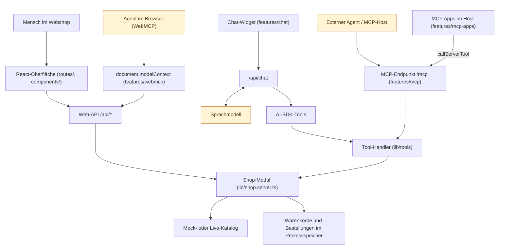

# Architektur

Die Anwendung zeigt drei Arten, Shop-Funktionen für KI zugänglich zu machen:

- **Chat:** Hilfe innerhalb der Web-Applikation.
- **WebMCP:** Zusammenarbeit mit einem Agenten auf der geöffneten Webseite.
- **MCP:** Zugriff durch externe Agenten ohne geöffneten Browser, ergänzt um MCP Apps.

Die Tools selbst sind normale deterministische Funktionen. KI kommt dort ins Spiel, wo das Modell entscheidet, welche Funktion mit welchen Argumenten ausgeführt wird.

## Aufrufwege

Die Pfeile zeigen Aufrufwege; Rückgaben sind weggelassen. Gelb hinterlegte Boxen stehen für ein Sprachmodell: Dort wird entschieden, welches Tool mit welchen Argumenten aufgerufen wird; alle anderen Boxen sind deterministischer Code. WebMCP und Chat aktualisieren die sichtbare Oberfläche zusätzlich über Browser-Events (`lib/shop-events.ts`). Externe MCP-Aufrufe erzeugen keine Events: Ein Agent ausserhalb der Seite kennt den Browser nicht. Der Webshop lädt Warenkorb und Aufträge neu, sobald das Fenster den Fokus zurückbekommt oder «Aktualisieren» geklickt wird.

## Ein Vertrag, drei Adapter

| Schicht      | Dateien                                                      | Aufgabe                                                                  |
| ------------ | ------------------------------------------------------------ | ------------------------------------------------------------------------ |
| Fachlogik    | `lib/shop-state.ts`, `lib/shop-rules.ts`                     | Warenkorb, Bestellungen, Mengenregel; kennt weder Session noch Protokoll |
| Shop-Modul   | `lib/shop.server.ts`                                         | Katalogzugriff plus Fachlogik; einzige Schnittstelle für alle Adapter    |
| Tool-Schicht | `lib/tools/contracts.ts`, `handlers.server.ts`, `results.ts` | Name, Beschreibung und Schema der Tools; Ausführung; Resultat-Typen      |
| Adapter      | `features/chat`, `features/mcp`, `features/webmcp`           | Ergänzen nur Session-Bindung, `loginId`, Streaming oder Browser-Events   |

| Zugang   | Konto-Kontext                              | Checkout-Freigabe                                    |
| -------- | ------------------------------------------ | ---------------------------------------------------- |
| Web-API  | Demo-Konto aus dem Session-Cookie          | Button in der Oberfläche                             |
| Chat     | Session-Cookie, serverseitig ausgewertet   | `toolApproval` im AI SDK (Ja/Nein oder Dialog)       |
| WebMCP   | Session-Cookie über die Web-API            | keine, der Browser-Agent ist der Aufrufer            |
| MCP      | `loginId` als Tool-Argument                | keine serverseitige Prüfung; Host kann sie verlangen |
| MCP Apps | `loginId` aus Tool-Eingaben und Resultaten | Button in der App                                    |

## Bewusste Vereinfachungen der Demo

- Die Kontoauswahl ist keine Authentifizierung. Das Cookie wird nicht verifiziert, MCP akzeptiert jede bekannte `loginId`.
- Der Zustand liegt im Prozessspeicher. `/mcp` und die Web-API teilen ihn; `npm run start:stdio` ist ein eigener Prozess mit eigenem Zustand.
- Checkout erzeugt eine lokale Bestellung; es findet kein externer Checkout statt.
- Die Chat-Route begrenzt Body-Grösse, Nachrichtenanzahl, Anfragen pro Minute, Schritte, Tokens und Laufzeit (`features/chat/server/chat-guard.server.ts`). Für den öffentlichen MCP-Endpunkt gibt es einen optionalen, lokal inaktiven Schutz (`features/mcp/public-demo-guard.server.ts`).
