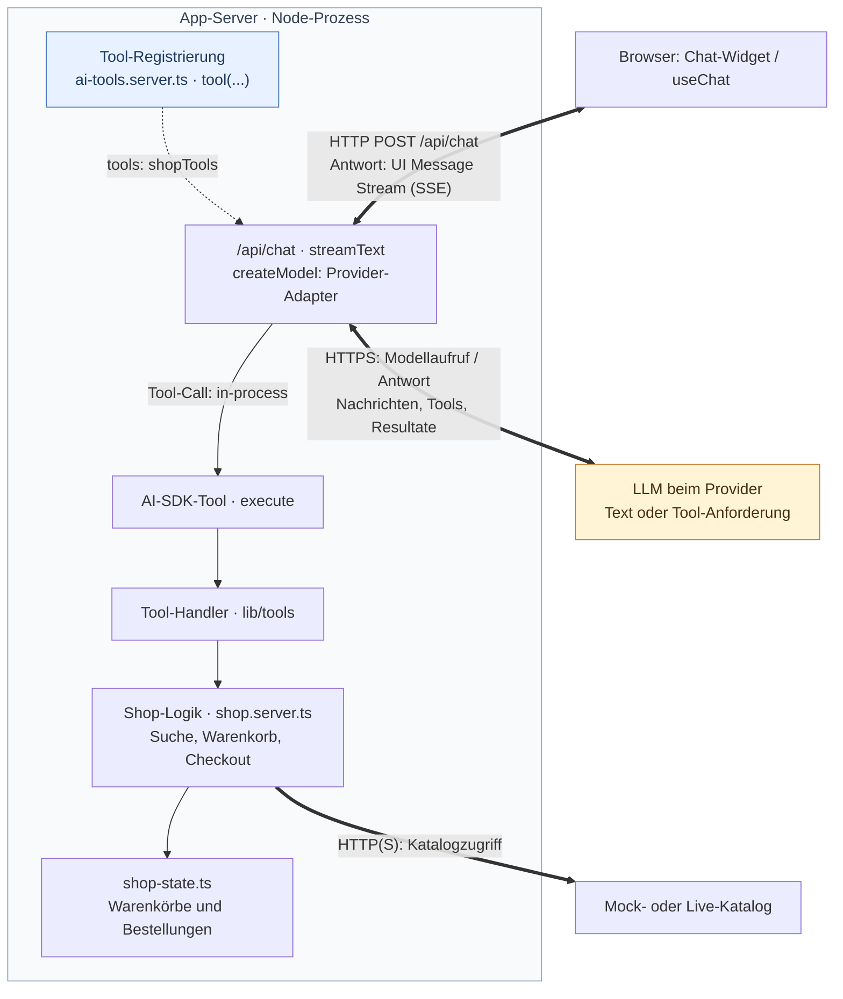
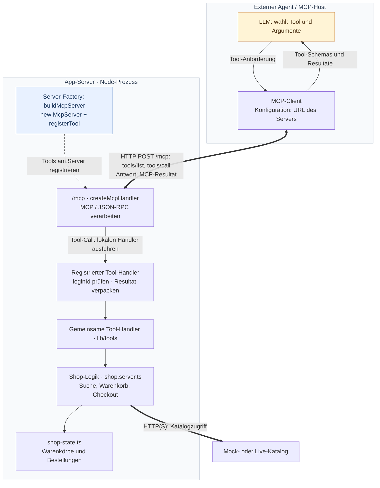
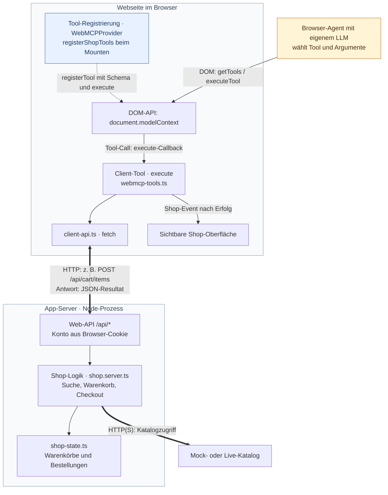

# Key Learnings

Drei Wege, dieselben Shop-Funktionen für ein LLM zugänglich zu machen. Die gekürzten Codeausschnitte stammen aus dieser Abschlusslösung.

Die Diagramme zeigen Ausschnitte aus den [Aufrufwegen der Architektur](./ARCHITECTURE.md#aufrufwege): **Gelb** markiert das LLM, **Blau** die Tool-Registrierung. Dicke Pfeile zeigen Netzwerkkommunikation, gestrichelte Pfeile die Registrierung und normale Pfeile lokale Aufrufe bzw. den Kontrollfluss. Rückgaben sind nur teilweise eingezeichnet.

## 1. LLM in the app

Das LLM wird von der Anwendung angesprochen. Es wählt Tools aus; das AI SDK führt deren Funktionen im App-Server aus.



**Modell instanziieren.** [provider.server.ts](../src/features/chat/server/provider.server.ts), `createModel()`, liest `AI_PROVIDER`, `AI_MODEL` und den API-Key. Es erstellt einen SDK-Adapter für das entfernte Modell, beispielsweise:

```ts
return createOpenAI({ apiKey: process.env.OPENAI_API_KEY })(id)
```

**Tools definieren und übergeben.** In [ai-tools.server.ts](../src/features/chat/server/ai-tools.server.ts) verbindet `shopTools` Beschreibungen und Zod-Schemas mit ausführbaren Funktionen:

```ts
addToCart: tool({
  description: toolDescriptions.addToCart,
  inputSchema: addToCartInput,
  execute: forSession((loginId, input) =>
    toolHandlers.addToCart(loginId, input),
  ),
}),
```

`forSession` ermittelt das Konto aus dem Browser-Cookie. Die [Chat-Route](../src/features/chat/server/chat-route.server.ts) erzeugt bei `POST /api/chat` den Modelladapter und übergibt die Tools an das SDK:

```ts
const result = streamText({
  model: createModel(),
  messages: await convertToModelMessages(guard.messages, { tools: shopTools }),
  tools: shopTools,
  stopWhen: isStepCount(chatLimits.maxSteps),
  // Weitere Optionen im Quellcode.
})
```

**Aufruf und Serverlogik.** Bei «Suche Milch und lege zwei in den Warenkorb» fordert das Modell zunächst `searchProducts`, danach `addToCart` an. Das SDK ruft die jeweilige `execute`-Funktion **in-process, ohne MCP** auf und gibt das Resultat in die nächste Modellrunde. In [handlers.server.ts](../src/lib/tools/handlers.server.ts) delegieren die Tools an [shop.server.ts](../src/lib/shop.server.ts): Suche lädt Katalogdaten; Hinzufügen lädt einen Artikel und ändert den Warenkorb; Entfernen und Checkout ändern den Zustand in [shop-state.ts](../src/lib/shop-state.ts). Checkout erzeugt eine Bestellung. Der Katalogzugriff kann HTTP verwenden; der Aufruf des Tool-Handlers selbst ist ein normaler Funktionsaufruf.

**Streaming zum Client.** Dieselbe Chat-Route liefert Text, Tool-Aufrufe und Tool-Resultate fortlaufend als UI Message Stream über HTTP/SSE:

```ts
return createUIMessageStreamResponse({
  stream: toUIMessageStream({
    stream: result.stream,
    originalMessages: guard.messages,
  }),
})
```

[chat-client.ts](../src/features/chat/client/chat-client.ts) verbindet `DefaultChatTransport` mit `/api/chat`. [ChatbotWidget.tsx](../src/features/chat/ui/ChatbotWidget.tsx) liest über `useChat` die laufend eintreffenden Nachrichten-Parts und rendert sie.

## 2. App in the Agent

Das LLM und die Tool-Auswahl liegen im externen Agenten. Der Webshop bietet seine Serverfunktionen über MCP an.



**MCP im Client konfigurieren.** Der Client benötigt die Adresse des MCP-Servers. [inspector.json](../inspector.json) enthält beispielsweise diese lokale Konfiguration für den Workshop-Inspector, gestartet mit `npm run inspector`:

```json
{
  "mcpServers": {
    "webshop-local": {
      "type": "http",
      "url": "http://localhost:3052/mcp",
      "protocolEra": "modern"
    }
  }
}
```

Das Konfigurationsformat ist clientabhängig. Der Client fragt über `tools/list` Namen, Beschreibungen und Eingabeschemas ab und stellt sie dem Agenten zur Verfügung.

**Server instanziieren und Tools registrieren.** [mcp/server.ts](../src/features/mcp/server.ts), `buildMcpServer()`, erzeugt eine `McpServer`-Instanz und registriert die Tools mit `server.registerTool(...)`. Beispiel, auf die wesentlichen Teile gekürzt:

```ts
const server = new McpServer({ name: 'webshop-mcp-app', version: '3.0.0' })

server.registerTool(
  'addToCart',
  {
    description: toolDescriptions.addToCart,
    inputSchema: withLoginId(addToCartInput),
  },
  withAccount(async (loginId, { articleNumber, quantity }) => {
    const data = await toolHandlers.addToCart(loginId, {
      articleNumber,
      quantity,
    })
    return toolResult(
      cartPayload(loginId, data),
      data.ok ? `Artikel ${articleNumber} hinzugefügt.` : data.error,
    )
  }),
)
```

`withLoginId` ergänzt das Schema um das Demo-Konto; `withAccount` prüft es. Der Handler verwendet **dieselbe Serverlogik wie der App-Chat**. Der externe Agent bringt keine Browser-Session mit und nennt deshalb `loginId` ausdrücklich.

**MCP-Protokoll um die Funktionen legen.** [mcp/handler.ts](../src/features/mcp/handler.ts) verbindet die Server-Factory mit dem Transport:

```ts
export const mcpHandler = createMcpHandler(buildMcpServer)
```

[routes/mcp.tsx](../src/routes/mcp.tsx) leitet HTTP-Requests an `mcpHandler.fetch(request)` weiter. Das SDK verarbeitet MCP-Nachrichten und ruft den registrierten Handler auf. `toolResult(...)` verpackt dessen Rückgabe als `content` (Text), `structuredContent` (Daten) und bei Fehlern `isError: true`.

**Wann und wie aufrufen?** Entscheidet sich das Modell im Agenten für `addToCart`, sendet dessen MCP-Client einen JSON-RPC-Aufruf `tools/call` mit Tool-Name und Argumenten per **HTTP POST an `/mcp`**. Der Server führt die Funktion aus und antwortet über MCP. Der Agent verwendet das Resultat für die nächste Modellrunde.

## 3. WebMCP

Die geöffnete Webseite bietet Tools über eine DOM-API an. Deren Funktionen laufen im Browser und verwenden anschliessend die vorhandene Web-API.



**Tools im Client registrieren.** [WebMCPProvider.tsx](../src/features/webmcp/WebMCPProvider.tsx) startet die Registrierung beim Mounten im Browser:

```tsx
useEffect(() => {
  if (!document.modelContext) return
  return registerShopTools(document.modelContext)
}, [])
```

[webmcp-tools.ts](../src/features/webmcp/webmcp-tools.ts) erstellt mit `defineTool(...)` jeweils Name, Beschreibung, JSON Schema und `execute`-Callback. `registerShopTools(...)` registriert diese Objekte mit `modelContext.registerTool(tool, { signal: controller.signal })`. Beim Unmount meldet `controller.abort()` sie wieder ab.

**Clientlogik und API-Aufruf.** `execute` validiert die Argumente und führt den jeweiligen Callback aus. Beim Hinzufügen ist dessen Kern:

```ts
const cart = await addToCart(articleNumber, quantity)
dispatchCartChanged()
```

`addToCart` aus [client-api.ts](../src/lib/client-api.ts) sendet `POST /api/cart/items` mit Artikelnummer und Menge. Das Browser-Cookie bestimmt das Konto; das Tool benötigt keine `loginId`. Der API-Endpunkt führt die Shop-Logik auf dem Server aus. Anschliessend aktualisiert `dispatchCartChanged()` die sichtbare Oberfläche über ein Browser-Event.

**Wann und wie aufrufen?** Wenn der Browser-Agent eine Shop-Aktion ausführen will, nutzt er die registrierten Tools der Seite. Die [ToolConsole.tsx](../src/features/webmcp/ToolConsole.tsx) macht diesen Zugang ohne LLM nachvollziehbar: `document.modelContext.getTools()` listet Tools; `document.modelContext.executeTool(...)` führt ein gewähltes Tool aus. Der Browser ruft dessen `execute`-Callback auf.

Die Grenze Agent → Tool ist hier ein DOM-Aufruf. Erst die Clientfunktion im Tool erzeugt den HTTP-Aufruf zur Shop-API.
